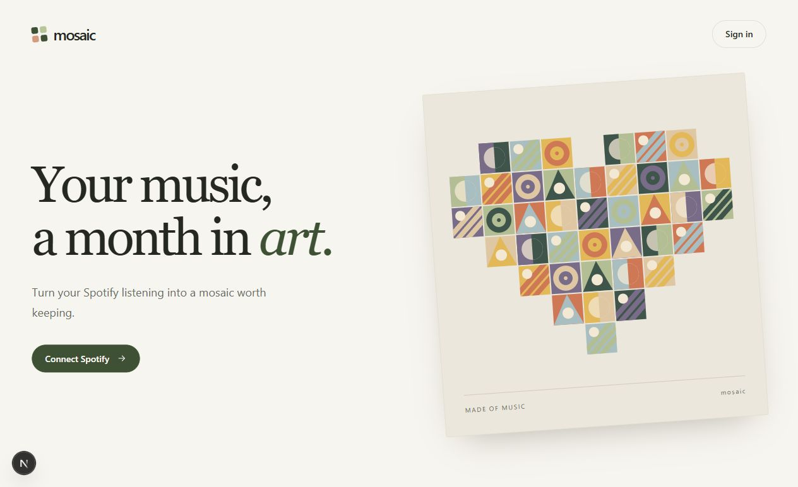
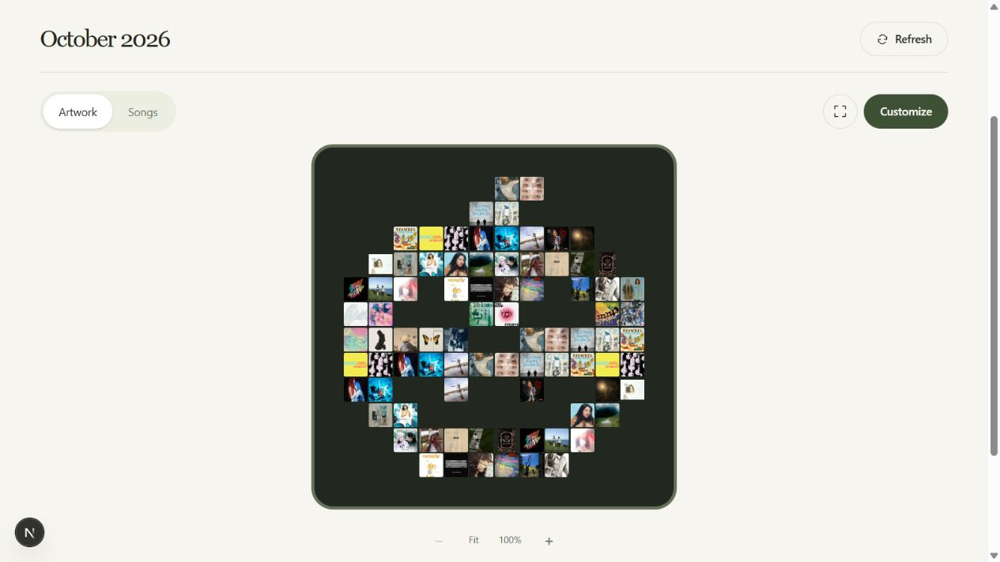
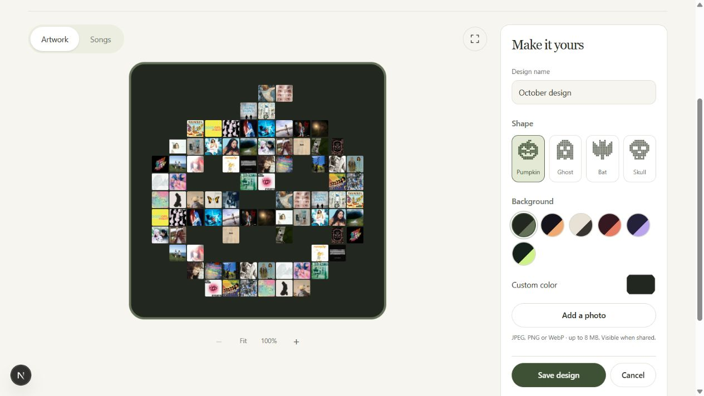

# Mosaic

**Your music, a month in art.**

Mosaic turns your recent Spotify listening into album-cover artwork. Create a
monthly snapshot, explore the songs behind each tile, and build a private
collection. Make it your own with custom shapes, colors, frames, and photos,
then download a card or share an interactive artwork link.



[Features](#features) · [Screenshots](#screenshots) · [Tech stack](#tech-stack) ·
[Local setup](#local-setup) · [Development](#development) · [Troubleshooting](#troubleshooting)

## Features

- **Spotify sign-in.** Connect your account, return to your dashboard, and sign
  out directly from your collection. Spotify credentials stay on the server.
- **Monthly artwork.** Generate a snapshot from up to 50 recent top tracks.
  Album covers fill a monthly shape, including a jack-o'-lantern for October.
  Generation saves the snapshot automatically.
- **Private collection.** Revisit saved months without replacing their original
  listening selection. Loading progress, retry controls, and unavailable-cover
  placeholders keep the collection usable when Spotify is slow or unavailable.
- **Song explorer.** Select a cover to see its song and artist, move between songs,
  or open the track in Spotify. Switch to a searchable song list, zoom into the
  artwork, or explore it full screen. Listening happens in Spotify.
- **Customization studio.** Create up to 12 saved variations per month using
  the month's enlisted shapes. Choose a palette or custom colors, adjust
  frames and corners, and add a background photo with position and darkness
  controls. Name, edit, and delete variations while keeping the source snapshot.
- **Downloads.** Export PNG cards in square (1080 × 1080) or story (1080 × 1920)
  format, with native device sharing where supported.
- **Interactive sharing.** Enable a link for an individual saved variation so
  visitors can explore its songs without signing in. Turn sharing off to revoke
  the link; other months remain private.

### What a monthly snapshot represents

Spotify's short-term top tracks reflect approximately the preceding four weeks
at generation time, rather than exact calendar-month play counts. Months use UTC.
You generate the current month explicitly; there is no background scheduler or
backfilling of missed months. Generating again returns the saved snapshot.
Mosaic currently has no followers or social feed.

## Screenshots

**Monthly collection** — explore the songs behind a saved seasonal mosaic.



**Customization studio** — change shapes, palettes, and backgrounds while
previewing the artwork.



These are captures of the running application. The collection and studio show
real Spotify listening data, used with the account owner's permission. The landing
page uses its built-in illustration. See [screenshot notes](docs/images/README.md)
for capture details.

## Tech stack

| Area | Technologies |
| --- | --- |
| Frontend | Next.js 16 App Router, React 19, TypeScript 5 |
| Styling | Tailwind CSS 4, CSS custom properties |
| API | Python 3.14+, FastAPI, Pydantic settings and validation |
| Database | PostgreSQL 18, async SQLAlchemy, asyncpg |
| Migrations | Alembic |
| Spotify | Web API, OAuth authorization code flow |
| Sessions and credentials | HttpOnly session cookies, hashed session tokens, Fernet-encrypted refresh tokens |
| Images | Browser Canvas for PNG exports; Pillow for uploaded photo normalization |
| Tooling | npm, uv, Docker Compose, ESLint, Ruff, pytest, respx |

Exact dependency versions are recorded in `frontend/package-lock.json` and
`backend/uv.lock`.

## Local setup

### 1. Prerequisites

Clone or download this repository, then open a terminal in its root directory.
Install:

- Node.js **20.9+** and npm.
- Python **3.14+** and [uv](https://docs.astral.sh/uv/getting-started/installation/).
- [Docker Desktop](https://docs.docker.com/desktop/) or Docker Engine with Compose,
  with Docker running.
- A Spotify account and a Spotify developer application for live sign-in.

To try only the interface, install the frontend dependencies and run its server
as shown in step 5, then visit [the local demo](http://127.0.0.1:3000/qa-remix).
This preview uses in-memory fixtures, needs no API/database/Spotify credentials,
and resets when reloaded. It does not verify live Spotify integration.

### 2. Create local environment files

Copy each example **only if the destination does not already exist**.

**macOS / Linux / Git Bash**

```bash
cp -n .env.example .env
cp -n backend/.env.example backend/.env
cp -n frontend/.env.example frontend/.env.local
```

**PowerShell**

```powershell
if (!(Test-Path .env)) { Copy-Item .env.example .env }
if (!(Test-Path backend/.env)) { Copy-Item backend/.env.example backend/.env }
if (!(Test-Path frontend/.env.local)) { Copy-Item frontend/.env.example frontend/.env.local }
```

| File | Settings |
| --- | --- |
| `.env` | `POSTGRES_USER`, `POSTGRES_PASSWORD`, `POSTGRES_DB`, `POSTGRES_PORT` for Docker Compose |
| `backend/.env` | `DATABASE_URL`, `SPOTIFY_CLIENT_ID`, `SPOTIFY_CLIENT_SECRET`, `SPOTIFY_REDIRECT_URI`, `FRONTEND_URL`, `TOKEN_ENCRYPTION_KEY` |
| `frontend/.env.local` | `NEXT_PUBLIC_API_BASE_URL` (defaults to `http://127.0.0.1:8000`) |

The examples include matching development-only database credentials. If you
change the database user, password, name, or port, update `DATABASE_URL` too.
Keep real environment files out of Git. `NEXT_PUBLIC_` values are visible in the
browser and must never contain secrets.

### 3. Configure Spotify and token encryption

Create an application in the [Spotify Developer Dashboard](https://developer.spotify.com/dashboard)
with Web API access. Register this exact redirect URI:

```text
http://127.0.0.1:8000/api/auth/spotify/callback
```

Copy the application's Client ID and Client Secret into `backend/.env`, and keep
these local URLs:

```dotenv
SPOTIFY_REDIRECT_URI=http://127.0.0.1:8000/api/auth/spotify/callback
FRONTEND_URL=http://127.0.0.1:3000
```

For development-mode apps, Spotify requires a Premium account for the app owner
and an allowlisted account for each listener. Check the current
[Spotify quota-mode requirements](https://developer.spotify.com/documentation/web-api/concepts/quota-modes)
and add your test account in the developer dashboard. Spotify accepts explicit
loopback IPs for local HTTP callbacks; `localhost` is not an allowed callback
hostname. See [Spotify redirect URI requirements](https://developer.spotify.com/documentation/web-api/concepts/redirect_uri).

Install the backend dependencies and generate an encryption key:

```bash
cd backend
uv sync --locked
uv run python -c "from cryptography.fernet import Fernet; print(Fernet.generate_key().decode())"
```

Paste the output into `TOKEN_ENCRYPTION_KEY` in `backend/.env`. Generate it once
and keep it stable across restarts so existing refresh tokens remain readable.
Return to the repository root:

```bash
cd ..
```

Mosaic requests `user-read-private`, `user-top-read`, and `user-library-read`.
If an existing connection lacks a scope, reconnect Spotify to grant it.

### 4. Start PostgreSQL and apply migrations

From the repository root:

```bash
docker compose up -d db
docker compose ps
docker compose exec db pg_isready -U mosaic -d mosaic
```

The readiness command assumes the example database name and user; substitute your
values if changed. Wait for PostgreSQL to report that it is accepting connections.
Then apply the schema:

```bash
cd backend
uv run alembic upgrade head
uv run alembic check
cd ..
```

Alembic reads `backend/.env` when run from `backend/`. It requires only
`DATABASE_URL`; the application itself also needs the Spotify settings. Exported
environment variables take precedence over values in `.env`.

### 5. Run the API and frontend

Open two terminals, starting each from the repository root.

**Terminal 1 — API**

```bash
cd backend
uv run fastapi dev
```

**Terminal 2 — frontend**

```bash
cd frontend
npm ci
npm run dev
```

Open [Mosaic](http://127.0.0.1:3000), choose **Connect Spotify**, and approve the
requested access. From the dashboard, open your collection and create the current
month's artwork. Use **Customize** to save a variation, then **Download & share**
to export it or enable a link.

Use **`127.0.0.1` consistently** for the browser, API URL, and OAuth callback.
The API's current CORS configuration permits `http://127.0.0.1:3000` only.

| Local endpoint | Purpose |
| --- | --- |
| [App](http://127.0.0.1:3000) | Landing page and Spotify connection |
| [Collection](http://127.0.0.1:3000/monthly) | Monthly artwork, song explorer, customization, and sharing |
| [API docs](http://127.0.0.1:8000/docs) | Interactive OpenAPI documentation |
| [Health](http://127.0.0.1:8000/api/health) | API process check; does not test database or Spotify connectivity |
| [Demo preview](http://127.0.0.1:3000/qa-remix) | Synthetic collection and studio without sign-in |

## Development

### Run checks

After installing both dependency sets, run from the repository root with Docker
running:

```bash
uv run --project backend --locked python scripts/verify.py
```

This runs architecture guardrails, Ruff, frontend lint/type checking/production
build, and the backend suite against disposable PostgreSQL 18. It rejects skipped
backend tests and does not use your development database. Spotify calls in the
suite are mocked; live OAuth and catalog behavior require a configured developer
app and manual acceptance checks.

For focused checks:

| Working directory | Command | Purpose |
| --- | --- | --- |
| `frontend/` | `npm run lint` | ESLint |
| `frontend/` | `npm run typecheck` | Next route types and TypeScript |
| `frontend/` | `npm run build` | Production build |
| `backend/` | `uv run ruff check .` | Python lint |
| `backend/` | `uv run pytest -ra` | Backend tests; database tests skip without `TEST_DATABASE_URL` |
| `backend/` | `uv run python -m app.db.check` | Development database connectivity |

Direct pytest is not a substitute for the full verifier. See
[verification details](docs/CONVENTIONS.md#verification).

### Database maintenance

After pulling changes, run `uv run alembic upgrade head` from `backend/`.
When changing database models, generate and review a migration:

```bash
uv run alembic revision --autogenerate -m "describe schema change"
uv run alembic upgrade head
uv run alembic check
```

An optional local fixture is available with `uv run python -m app.db.seed --local`
from `backend/`. It creates an idempotent test profile, but no Spotify connection
or login session.

From the repository root, `docker compose stop db` stops the database while
preserving data; `docker compose up -d db` starts it again. `docker compose down`
removes the container and network while retaining the named volume.
**`docker compose down -v` permanently deletes the local database.**

### Repository guide

| Path | Contents |
| --- | --- |
| `frontend/src/app/` | Next.js pages and routes |
| `frontend/src/components/` | Collection, explorer, studio, sharing, and builder components |
| `backend/app/` | FastAPI routes, services, repositories, models, and schemas |
| `backend/migrations/` | Alembic database migrations |
| `backend/tests/` | API, persistence, migration, and guardrail tests |
| `scripts/` | Full verification and boundary checks |
| `docs/` | Feature reference, conventions, and acceptance checklists |
| `docs/images/` | README screenshots and capture notes |

For implementation work, start with [AGENTS.md](AGENTS.md), the
[feature map](docs/FEATURE_MAP.md), and [conventions](docs/CONVENTIONS.md).
Frontend contributors should also read [frontend/AGENTS.md](frontend/AGENTS.md).

## Privacy and sharing

Monthly snapshots are private by default. A saved variation becomes public only
when you enable its artwork link. Anyone with that link can see the shared design,
your display name, uploaded background photo, and associated songs. Editing a
shared variation updates the same link; turning sharing off invalidates it.
Revoking a link cannot recall images someone has already downloaded.

Spotify access tokens stay in server memory; refresh tokens are encrypted in
PostgreSQL. Sessions use HttpOnly cookies and store token digests in the database.
Snapshots store Spotify IDs and layout information; Spotify catalog metadata and
cover art are fetched as needed. Uploaded background photos are normalized,
stripped of metadata, and stored separately from Spotify cover art in PostgreSQL.

## Troubleshooting

| Symptom | Check |
| --- | --- |
| API fails during startup | Run from `backend/`; fill in `backend/.env` before starting the API. |
| Database connection fails | Confirm Docker is running, `docker compose ps` shows a healthy database, and `DATABASE_URL` matches the root `.env`. |
| Database tables are missing | Run `uv run alembic upgrade head` from `backend/`. |
| Spotify rejects the callback | Match the registered redirect URI exactly, including host, port, and path. |
| Spotify returns access errors | Check developer-app eligibility, the listener allowlist, and granted scopes; reconnect if needed. |
| Login loops or browser requests fail | Use `127.0.0.1:3000`, not `localhost:3000`, and verify `NEXT_PUBLIC_API_BASE_URL`. |
| Session expires | Sign in again; sessions currently last one hour. |
| No artwork can be generated | The account needs usable recent top tracks. Empty listening data does not create a snapshot. |
| Artwork is incomplete or rate-limited | Use the displayed retry controls and wait for any indicated cooldown. Saved layouts remain intact. |
| A photo cannot be saved | Use JPEG, PNG, or WebP up to 8 MB and 20 megapixels. |
| PNG export fails | Wait for covers to load, then retry. Image availability and cross-origin image access can affect exports. |

The checked-in server configuration targets local development. Production hosting
still needs deployment-specific CORS, HTTPS/secure-cookie configuration, and
operational setup; changing environment URLs alone does not provide those.
